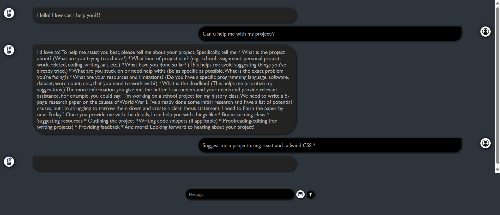

#AI Chatbot

An AI-powered chatbot built with **HTML, CSS, and JavaScript**, using the **Gemini API** for natural language understanding.  
This project simulates a responsive and interactive chatbot, ideal for customer support or general Q&A use cases.

## Features
- Understands and processes natural language queries.
- Uses the **Gemini API** for AI-driven responses.
- Responsive and minimal UI design.
- Instant response rendering without page reload.
- Easily embeddable into any website.

## Tech Stack
- Frontend: HTML, CSS, JavaScript
- API: Gemini API
- Tools: VSCode, GitHub Pages (optional for hosting)

## Project Structure
- index.html # Main HTML page with chatbot UI
- style.css # Styling for the chatbot interface
- script.js # Chatbot logic and API integration
- README.md # Project documentation

## Screenshot
- 
  
